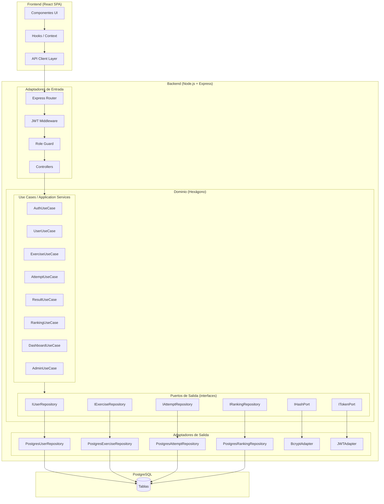
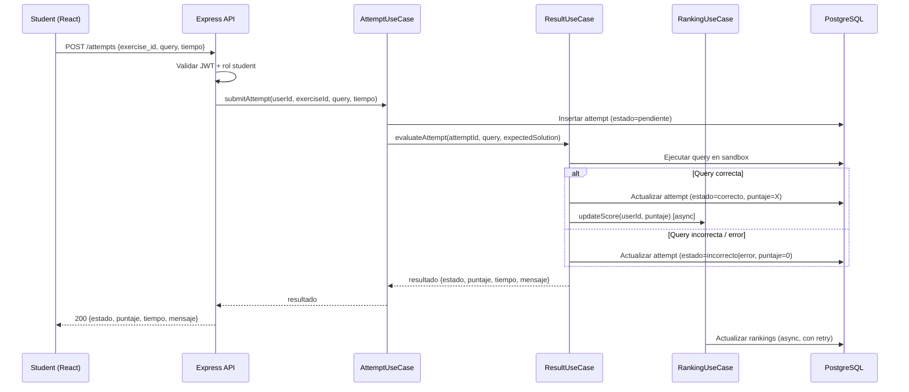

# Design Document — QueryArena

## Overview

QueryArena es una plataforma full-stack para la práctica estructurada de SQL. Los estudiantes resuelven ejercicios categorizados por nivel y categoría, reciben evaluación inmediata, acumulan puntos y se comparan en un ranking. Los administradores gestionan el catálogo de ejercicios, niveles y categorías.

**Stack tecnológico:**
- Frontend: React (SPA)
- Backend: Node.js + Express (API REST)
- Base de datos: PostgreSQL (opcionalmente SQL Server)
- Autenticación: JWT (stateless)

El backend adopta una **arquitectura hexagonal (Ports & Adapters)** simplificada: el núcleo de dominio no depende de ningún framework ni de la base de datos; las dependencias externas (Express, PostgreSQL, bcrypt, JWT) se conectan al dominio a través de interfaces (puertos) e implementaciones intercambiables (adaptadores). El frontend mantiene una separación clara entre componentes UI, lógica de negocio (hooks/context) y capa de acceso a la API.

---

## Architecture

### Arquitectura hexagonal — Principios aplicados

En la arquitectura hexagonal el **dominio** es el núcleo y nunca importa nada del mundo exterior (frameworks, ORM, HTTP). Las dependencias siempre apuntan hacia adentro:

```
[ Adaptadores de entrada ]  →  [ Dominio (puertos + use cases) ]  →  [ Adaptadores de salida ]
  HTTP (Express controllers)      Use Cases / Application Services     PostgreSQL repositories
  JWT middleware                  Domain entities & interfaces         bcrypt adapter
                                  Port interfaces (contratos)          JWT token adapter
```

- **Puerto de entrada (Driving Port)**: interfaz que el mundo exterior llama para activar el dominio (ej. `IAuthUseCase`).
- **Puerto de salida (Driven Port)**: interfaz que el dominio requiere del exterior (ej. `IUserRepository`, `IHashPort`).
- **Adaptador de entrada**: implementación concreta del puerto de entrada expuesta al exterior (controllers de Express).
- **Adaptador de salida**: implementación concreta del puerto de salida (repositorios PostgreSQL, bcrypt, JWT).

### Diagrama de alto nivel



### Flujo de resolución de ejercicio



---

## Components and Interfaces

### Backend — Estructura de carpetas (Hexagonal)

La organización de carpetas refleja las tres zonas del hexágono: dominio, adaptadores de entrada y adaptadores de salida.

```
src/
├── domain/                          # Núcleo — sin dependencias externas
│   ├── entities/                    # Entidades del dominio
│   │   ├── User.ts
│   │   ├── Exercise.ts
│   │   ├── Attempt.ts
│   │   └── Ranking.ts
│   ├── ports/
│   │   ├── in/                      # Puertos de entrada (contratos de use cases)
│   │   │   ├── IAuthUseCase.ts
│   │   │   ├── IUserUseCase.ts
│   │   │   ├── IExerciseUseCase.ts
│   │   │   ├── IAttemptUseCase.ts
│   │   │   ├── IResultUseCase.ts
│   │   │   ├── IRankingUseCase.ts
│   │   │   ├── IDashboardUseCase.ts
│   │   │   └── IAdminUseCase.ts
│   │   └── out/                     # Puertos de salida (contratos que el dominio requiere)
│   │       ├── IUserRepository.ts
│   │       ├── IExerciseRepository.ts
│   │       ├── IAttemptRepository.ts
│   │       ├── IRankingRepository.ts
│   │       ├── IHashPort.ts         # bcrypt (abstracción)
│   │       └── ITokenPort.ts        # JWT (abstracción)
│   └── use-cases/                   # Implementaciones de los use cases
│       ├── AuthUseCase.ts
│       ├── UserUseCase.ts
│       ├── ExerciseUseCase.ts
│       ├── AttemptUseCase.ts
│       ├── ResultUseCase.ts
│       ├── RankingUseCase.ts
│       ├── DashboardUseCase.ts
│       └── AdminUseCase.ts
│
├── adapters/
│   ├── in/                          # Adaptadores de entrada (HTTP)
│   │   ├── http/
│   │   │   ├── controllers/
│   │   │   │   ├── auth.controller.ts
│   │   │   │   ├── user.controller.ts
│   │   │   │   ├── exercise.controller.ts
│   │   │   │   ├── attempt.controller.ts
│   │   │   │   ├── ranking.controller.ts
│   │   │   │   ├── dashboard.controller.ts
│   │   │   │   └── admin.controller.ts
│   │   │   ├── routes/
│   │   │   │   ├── auth.routes.ts
│   │   │   │   ├── user.routes.ts
│   │   │   │   ├── exercise.routes.ts
│   │   │   │   ├── attempt.routes.ts
│   │   │   │   ├── ranking.routes.ts
│   │   │   │   ├── dashboard.routes.ts
│   │   │   │   └── admin.routes.ts
│   │   │   └── middlewares/
│   │   │       ├── authenticate.ts  # Valida JWT via ITokenPort
│   │   │       ├── authorize.ts     # Verifica rol
│   │   │       └── errorHandler.ts  # Global error handler
│   └── out/                         # Adaptadores de salida (infraestructura)
│       ├── persistence/
│       │   ├── postgres/
│       │   │   ├── PostgresUserRepository.ts
│       │   │   ├── PostgresExerciseRepository.ts
│       │   │   ├── PostgresAttemptRepository.ts
│       │   │   └── PostgresRankingRepository.ts
│       │   └── mappers/             # ORM row → Domain entity
│       │       ├── user.mapper.ts
│       │       ├── exercise.mapper.ts
│       │       └── attempt.mapper.ts
│       ├── security/
│       │   ├── BcryptAdapter.ts     # Implementa IHashPort
│       │   └── JWTAdapter.ts        # Implementa ITokenPort
│       └── logger/
│           └── WinstonLogger.ts
│
├── infrastructure/                  # Configuración e inyección de dependencias
│   ├── container.ts                 # Wiring: asocia puertos con adaptadores
│   ├── database.ts                  # Conexión PostgreSQL
│   └── env.ts                       # Variables de entorno
└── app.ts                           # Bootstrap Express + rutas
```

**Regla clave**: `domain/` nunca importa de `adapters/` ni de `infrastructure/`. Las importaciones solo fluyen hacia adentro. La inyección de dependencias se realiza en `infrastructure/container.ts`.

### Frontend — Estructura de carpetas

```
src/
├── components/        # Componentes UI reutilizables (Button, Table, Form...)
├── pages/             # Vistas/rutas (Login, Register, Dashboard, Exercises...)
├── hooks/             # Custom hooks (useAuth, useAttempt, useRanking...)
├── context/           # React Context (AuthContext)
├── api/               # Capa de llamadas HTTP (authApi, exercisesApi, etc.)
├── types/             # TypeScript types/interfaces
└── utils/             # Helpers (validation, formatters)
```

### API Endpoints

#### Auth_Service — `/api/auth`

| Método | Ruta | Descripción | Auth requerida |
|--------|------|-------------|----------------|
| POST | `/api/auth/register` | Registrar nuevo usuario | No |
| POST | `/api/auth/login` | Iniciar sesión | No |

#### User_Service — `/api/users`

| Método | Ruta | Descripción | Auth requerida |
|--------|------|-------------|----------------|
| GET | `/api/users/me` | Obtener perfil propio | JWT (student/admin) |
| PATCH | `/api/users/me` | Actualizar perfil | JWT (student) |

#### Exercise_Service — `/api/exercises`

| Método | Ruta | Descripción | Auth requerida |
|--------|------|-------------|----------------|
| GET | `/api/exercises` | Listar ejercicios activos (filtros: level_id, category_id) | JWT (student) |
| GET | `/api/exercises/:id` | Detalle de ejercicio | JWT (student) |

#### Attempt_Service — `/api/attempts`

| Método | Ruta | Descripción | Auth requerida |
|--------|------|-------------|----------------|
| POST | `/api/attempts` | Enviar solución SQL | JWT (student) |
| GET | `/api/attempts` | Historial de intentos del usuario (filtro: exercise_id) | JWT (student) |

#### Ranking_Service — `/api/ranking`

| Método | Ruta | Descripción | Auth requerida |
|--------|------|-------------|----------------|
| GET | `/api/ranking` | Obtener ranking completo | JWT (student/admin) |

#### Dashboard_Service — `/api/dashboard`

| Método | Ruta | Descripción | Auth requerida |
|--------|------|-------------|----------------|
| GET | `/api/dashboard` | Resumen general del progreso | JWT (student) |
| GET | `/api/dashboard/by-level` | Progreso por nivel | JWT (student) |
| GET | `/api/dashboard/by-category` | Progreso por categoría | JWT (student) |
| GET | `/api/dashboard/recent` | Últimos 10 intentos | JWT (student) |

#### Admin_Service — `/api/admin`

| Método | Ruta | Descripción | Auth requerida |
|--------|------|-------------|----------------|
| GET | `/api/admin/levels` | Listar niveles | JWT (admin) |
| POST | `/api/admin/levels` | Crear nivel | JWT (admin) |
| PATCH | `/api/admin/levels/:id` | Editar nivel | JWT (admin) |
| DELETE | `/api/admin/levels/:id` | Eliminar nivel | JWT (admin) |
| GET | `/api/admin/categories` | Listar categorías | JWT (admin) |
| POST | `/api/admin/categories` | Crear categoría | JWT (admin) |
| PATCH | `/api/admin/categories/:id` | Editar categoría | JWT (admin) |
| DELETE | `/api/admin/categories/:id` | Eliminar categoría | JWT (admin) |
| GET | `/api/admin/exercises` | Listar ejercicios (todos) | JWT (admin) |
| POST | `/api/admin/exercises` | Crear ejercicio | JWT (admin) |
| PATCH | `/api/admin/exercises/:id` | Editar ejercicio | JWT (admin) |
| DELETE | `/api/admin/exercises/:id` | Eliminar ejercicio | JWT (admin) |

### Request / Response Schemas (selección)

**POST /api/auth/register**
```json
Request:  { "username": "string", "email": "string", "password": "string" }
Response: { "message": "User created successfully" }
```

**POST /api/auth/login**
```json
Request:  { "email": "string", "password": "string" }
Response: { "token": "JWT_STRING", "user": { "id": "uuid", "username": "string", "role": "student|admin" } }
```

**POST /api/attempts**
```json
Request:  { "exercise_id": "uuid", "query": "SELECT ...", "resolution_time_ms": 12345 }
Response: { "attempt_id": "uuid", "status": "correct|incorrect|error", "score": 10, "resolution_time_ms": 12345, "hint": "string|null" }
```

**GET /api/ranking**
```json
Response: [
  { "position": 1, "username": "alice", "accumulated_score": 150 },
  { "position": 2, "username": "bob",   "accumulated_score": 120 }
]
```

---

## Data Models

### Diagrama Entidad-Relación

```mermaid
erDiagram
    users {
        uuid id PK
        varchar username UK
        varchar email UK
        varchar password_hash
        varchar role "student | admin"
        boolean is_active
        timestamp created_at
        timestamp updated_at
    }

    levels {
        int id PK
        varchar name UK
        timestamp created_at
    }

    categories {
        int id PK
        varchar name UK
        timestamp created_at
    }

    exercises {
        uuid id PK
        varchar title
        text description
        text expected_solution
        int score
        boolean is_active
        int level_id FK
        int category_id FK
        timestamp created_at
        timestamp updated_at
    }

    attempts {
        uuid id PK
        uuid user_id FK
        uuid exercise_id FK
        text query_sent
        varchar status "correct | incorrect | error"
        int score
        int resolution_time_ms
        timestamp created_at
    }

    rankings {
        uuid id PK
        uuid user_id FK UK
        int accumulated_score
        timestamp last_correct_at
        timestamp updated_at
    }

    users ||--o{ attempts : "realiza"
    users ||--o| rankings  : "tiene"
    exercises ||--o{ attempts : "recibe"
    levels ||--o{ exercises : "clasifica"
    categories ||--o{ exercises : "agrupa"
```

### Notas sobre los modelos

- `attempts.status` tiene tres valores: `correct`, `incorrect`, `error`. El valor `error` representa fallos de sintaxis o ejecución de la consulta SQL.
- `rankings` es una tabla desnormalizada que almacena el puntaje acumulado para consultas O(1). Se actualiza de forma asíncrona tras cada intento correcto.
- `exercises.is_active` permite al admin desactivar ejercicios sin eliminarlos cuando tienen intentos asociados.
- `attempts` no tiene tabla `results` separada; el resultado queda embebido en la propia fila del intento (status + score) por simplicidad y rendimiento.
- Las contraseñas se almacenan únicamente como `password_hash` (bcrypt, coste ≥ 10); nunca en texto plano.

---

## Correctness Properties

*Una propiedad es una característica o comportamiento que debe mantenerse verdadero en todas las ejecuciones válidas del sistema — esencialmente, una declaración formal sobre lo que el sistema debe hacer. Las propiedades sirven como puente entre las especificaciones legibles por humanos y las garantías de corrección verificables automáticamente.*

### Property 1: Registro con datos válidos asigna rol student

*Para cualquier* combinación de `username`, `email` y `password` válidos (username no vacío, email con formato válido, password ≥ 8 caracteres, ambos únicos), el registro debe crear una cuenta con rol `student` y devolver una respuesta de éxito.

**Validates: Requirements 1.1**

---

### Property 2: Contraseña corta es rechazada siempre

*Para cualquier* string de longitud entre 0 y 7 caracteres enviado como `password` en el formulario de registro, el Auth_Service debe rechazar la solicitud y no crear ninguna cuenta.

**Validates: Requirements 1.4**

---

### Property 3: Username o email duplicado es rechazado

*Para cualquier* par de solicitudes de registro donde la segunda comparte el mismo `username` o el mismo `email` que la primera, la segunda solicitud debe ser rechazada con un error descriptivo y ninguna cuenta duplicada debe ser creada.

**Validates: Requirements 1.5, 1.6**

---

### Property 4: Contraseña almacenada siempre en bcrypt con coste ≥ 10

*Para cualquier* usuario registrado exitosamente, el hash de contraseña almacenado en la base de datos debe ser verificable con bcrypt y haber sido generado con un factor de coste mínimo de 10.

**Validates: Requirements 1.8**

---

### Property 5: Login exitoso produce JWT con claims correctas

*Para cualquier* usuario registrado, cuando hace login con credenciales correctas, el JWT devuelto debe ser válido, no expirado, y contener exactamente el `user_id`, el `role` y la fecha de expiración (`exp`) del usuario autenticado.

**Validates: Requirements 2.1, 2.6**

---

### Property 6: Credenciales incorrectas nunca emiten JWT

*Para cualquier* solicitud de login con email no registrado o password incorrecta, el Auth_Service debe rechazar la solicitud con un mensaje de error genérico y no emitir ningún JWT.

**Validates: Requirements 2.2, 2.3**

---

### Property 7: Perfil devuelto es completo y consistente

*Para cualquier* estudiante autenticado que solicite su perfil, la respuesta debe contener `username`, `email`, `created_at` y `role`, y estos valores deben coincidir exactamente con los almacenados en la base de datos.

**Validates: Requirements 3.1**

---

### Property 8: Actualización de perfil respeta unicidad

*Para cualquier* intento de actualizar un perfil con un `username` o `email` que ya pertenece a otro usuario diferente, la solicitud debe ser rechazada y el perfil original del solicitante debe permanecer sin cambios.

**Validates: Requirements 3.3, 3.4**

---

### Property 9: Catálogo devuelve solo ejercicios activos con campos completos

*Para cualquier* solicitud al catálogo de ejercicios por un estudiante autenticado, cada ejercicio devuelto debe tener `is_active = true` y contener los campos `title`, `description`, `level` y `category`.

**Validates: Requirements 4.1**

---

### Property 10: Filtrado por nivel o categoría es exhaustivo y exclusivo

*Para cualquier* `level_id` o `category_id` válido, la lista de ejercicios filtrada debe contener exactamente todos los ejercicios activos de ese nivel/categoría y ningún ejercicio de otro nivel/categoría.

**Validates: Requirements 4.2, 4.3**

---

### Property 11: Intento registrado contiene todos los campos requeridos

*Para cualquier* intento enviado por un estudiante autenticado con un `exercise_id` válido y una consulta no vacía, el registro persistido en la base de datos debe contener: `id` único, `user_id`, `exercise_id`, `query_sent`, `created_at`, `status`, `score` y `resolution_time_ms`.

**Validates: Requirements 5.1, 6.1**

---

### Property 12: Estado y puntaje del intento son siempre consistentes

*Para cualquier* intento evaluado, el par (`status`, `score`) debe satisfacer la invariante: si `status = 'correct'` entonces `score = puntaje_definido_del_ejercicio > 0`; si `status = 'incorrect'` o `status = 'error'` entonces `score = 0`. No existe ninguna combinación intermedia válida.

**Validates: Requirements 5.3, 5.4, 7.2, 7.3**

---

### Property 13: Historial de intentos está ordenado por fecha descendente

*Para cualquier* historial de intentos de un estudiante (con o sin filtro por ejercicio), los elementos de la respuesta deben estar ordenados de forma que `attempts[i].created_at >= attempts[i+1].created_at` para todo `i`.

**Validates: Requirements 6.2, 6.3**

---

### Property 14: Puntaje acumulado en ranking es la suma de intentos correctos

*Para cualquier* historial arbitrario de intentos de un estudiante (mezcla de correctos, incorrectos y con error), el `accumulated_score` del estudiante en el ranking debe ser exactamente igual a la suma de los `score` de todos sus intentos con `status = 'correct'`.

**Validates: Requirements 8.1, 8.2**

---

### Property 15: Ranking ordenado correctamente con desempate por fecha

*Para cualquier* conjunto de estudiantes con sus puntajes acumulados, el ranking devuelto debe estar ordenado de mayor a menor `accumulated_score`; para estudiantes con el mismo puntaje, deben ordenarse por `last_correct_at` ascendente (quien alcanzó el puntaje primero aparece primero).

**Validates: Requirements 8.3, 8.5, 10.1, 10.2**

---

### Property 16: Dashboard refleja datos reales del estudiante

*Para cualquier* estudiante autenticado, el dashboard debe devolver contadores que correspondan exactamente a los datos reales: `total_attempted` = número de ejercicios únicos intentados, `total_correct` = número de ejercicios resueltos correctamente al menos una vez, `accumulated_score` = igual al del ranking, `ranking_position` = posición real en el ranking.

**Validates: Requirements 9.1**

---

### Property 17: Progreso por nivel y categoría es exacto

*Para cualquier* historial de intentos, los datos de progreso por nivel (y por categoría) devueltos por el Dashboard_Service deben coincidir exactamente con los conteos reales de intentos y ejercicios resueltos correctamente agrupados por nivel (o categoría).

**Validates: Requirements 9.2, 9.3**

---

### Property 18: Eliminación de nivel/categoría/ejercicio con dependencias es atómica y siempre rechazada

*Para cualquier* nivel con `n > 0` ejercicios asociados, o cualquier categoría con `n > 0` ejercicios, o cualquier ejercicio con `n > 0` intentos, la operación de eliminación debe ser rechazada **atómicamente** — el recurso debe seguir existiendo en la base de datos independientemente de si el mecanismo de reporte de errores falla o no.

**Validates: Requirements 11.4, 12.4, 13.4**

---

### Property 19: Solicitudes sin JWT válido son rechazadas con 401

*Para cualquier* ruta protegida, toda solicitud que no incluya un JWT válido y no expirado debe ser rechazada con código HTTP 401 antes de ejecutar ninguna lógica de negocio.

**Validates: Requirements 14.1, 14.4**

---

### Property 20: Validación de firma JWT previene tokens adulterados

*Para cualquier* JWT cuya firma haya sido modificada (aunque el payload sea sintácticamente válido), el Auth_Service debe rechazar la solicitud con código 401.

**Validates: Requirements 14.5**

---

### Property 21: Acceso entre roles es bloqueado con 403

*Para cualquier* ruta exclusiva de admin, una solicitud autenticada con rol `student` debe recibir código 403. Simétricamente, para las rutas de resolución de ejercicios reservadas a estudiantes, una solicitud autenticada con rol `admin` debe recibir código 403.

**Validates: Requirements 14.2, 14.3**

---

### Property 22: Logs registran todos los errores no controlados con metadatos

*Para cualquier* error no controlado que ocurra en el backend, el sistema de logs debe registrar al menos la ruta afectada, el tipo de error y un timestamp, sin que ello implique exponer detalles internos al cliente.

**Validates: Requirements 16.3**

---

## Error Handling

### Estrategia general

Todos los errores del backend siguen un formato de respuesta uniforme:

```json
{
  "error": {
    "code": "ERROR_CODE",
    "message": "Mensaje legible para el usuario",
    "field": "campo_afectado (opcional)"
  }
}
```

### Tabla de errores por servicio

| Servicio | Escenario | HTTP Status | Código de error |
|---------|-----------|-------------|-----------------|
| Auth_Service | Campo faltante en registro/login | 400 | `VALIDATION_ERROR` |
| Auth_Service | Username/email duplicado | 409 | `USERNAME_TAKEN` / `EMAIL_TAKEN` |
| Auth_Service | Password < 8 caracteres | 400 | `PASSWORD_TOO_SHORT` |
| Auth_Service | Credenciales inválidas | 401 | `INVALID_CREDENTIALS` |
| Auth_Service | Sin JWT o JWT inválido | 401 | `UNAUTHORIZED` |
| Auth_Service | JWT expirado | 401 | `SESSION_EXPIRED` |
| Auth_Service | Rol insuficiente | 403 | `FORBIDDEN` |
| Exercise_Service | Ejercicio no encontrado | 404 | `EXERCISE_NOT_FOUND` |
| Attempt_Service | Query vacía | 400 | `EMPTY_QUERY` |
| Attempt_Service | Ejercicio no existe | 404 | `EXERCISE_NOT_FOUND` |
| Attempt_Service | Error de persistencia en BD | 500 | `ATTEMPT_SAVE_FAILED` |
| Result_Service | Error de sintaxis SQL | 200 (status=error) | — (en body) |
| Result_Service | Error de ejecución SQL | 200 (status=error) | — (en body) |
| Admin_Service | Nivel/categoría con ejercicios | 409 | `HAS_ASSOCIATED_EXERCISES` |
| Admin_Service | Ejercicio con intentos | 409 | `HAS_ASSOCIATED_ATTEMPTS` |
| Admin_Service | Nombre de nivel/categoría duplicado | 409 | `NAME_ALREADY_EXISTS` |
| Admin_Service | level_id/category_id inexistente | 422 | `INVALID_REFERENCE` |

### Middleware de errores global

El `errorHandler` de Express captura cualquier error no controlado, lo registra en el log con ruta, tipo de error y timestamp, y devuelve una respuesta 500 genérica al cliente sin exponer detalles internos del stack trace.

### Errores de ranking asíncronos

Cuando `Ranking_Service.updateScore()` falla, el error se registra en el log y se encola un reintento usando un mecanismo simple de cola en memoria (o una tabla de pendientes en BD para mayor robustez). La respuesta al estudiante no se bloquea.

---

## Testing Strategy

### Enfoque dual: Unit Tests + Property-Based Tests

QueryArena utiliza un enfoque de testing combinado:

- **Unit tests**: verifican ejemplos concretos, casos de error y puntos de integración entre componentes.
- **Property-based tests (PBT)**: verifican propiedades universales a través de entradas generadas aleatoriamente (mínimo 100 iteraciones por propiedad).

Ambos son complementarios: los unit tests capturan bugs concretos conocidos, los PBT verifican la corrección general.

### Herramientas

| Contexto | Herramienta |
|----------|-------------|
| Unit/Integration tests (backend) | Jest + Supertest |
| Property-based tests (backend) | [fast-check](https://github.com/dubzzz/fast-check) |
| Tests de componentes (frontend) | React Testing Library + Jest |
| Tests E2E / UI | Playwright |
| Cobertura de código | Jest `--coverage` |

### Configuración de PBT

Cada property-based test debe:
- Ejecutar un **mínimo de 100 iteraciones** (fast-check por defecto usa 100, se puede incrementar con `numRuns`).
- Incluir un comentario de etiqueta que lo vincule a la propiedad del diseño:
  ```
  // Feature: query-arena, Property N: <texto de la propiedad>
  ```
- Implementar exactamente **una propiedad por test**.

### Cobertura por propiedad

| Propiedad | Test | Tipo |
|-----------|------|------|
| P1: Registro con datos válidos → rol student | `auth.use-case.spec.ts` | PBT |
| P2: Password corta rechazada | `auth.use-case.spec.ts` | PBT |
| P3: Username/email duplicado rechazado | `auth.use-case.spec.ts` | PBT |
| P4: Hash bcrypt coste ≥ 10 | `auth.use-case.spec.ts` | PBT |
| P5: Login exitoso → JWT con claims | `auth.use-case.spec.ts` | PBT |
| P6: Credenciales incorrectas → sin JWT | `auth.use-case.spec.ts` | PBT |
| P7: Perfil completo y consistente | `user.use-case.spec.ts` | PBT |
| P8: Actualización respeta unicidad | `user.use-case.spec.ts` | PBT |
| P9: Catálogo solo activos con campos completos | `exercise.use-case.spec.ts` | PBT |
| P10: Filtrado exclusivo y exhaustivo | `exercise.use-case.spec.ts` | PBT |
| P11: Intento con todos los campos | `attempt.use-case.spec.ts` | PBT |
| P12: Status/score siempre consistentes | `result.use-case.spec.ts` | PBT |
| P13: Historial ordenado por fecha desc | `attempt.use-case.spec.ts` | PBT |
| P14: Puntaje acumulado = suma correctos | `ranking.use-case.spec.ts` | PBT |
| P15: Ranking ordenado + desempate por fecha | `ranking.use-case.spec.ts` | PBT |
| P16: Dashboard con datos reales | `dashboard.use-case.spec.ts` | PBT |
| P17: Progreso por nivel/categoría exacto | `dashboard.use-case.spec.ts` | PBT |
| P18: Eliminación con dependencias → atómica | `admin.use-case.spec.ts` | PBT |
| P19: Sin JWT → 401 | `authenticate.middleware.spec.ts` | PBT |
| P20: JWT adulterado → 401 | `authenticate.middleware.spec.ts` | PBT |
| P21: Cross-role → 403 | `authorize.middleware.spec.ts` | PBT |
| P22: Logs registran errores con metadatos | `errorHandler.middleware.spec.ts` | PBT |

### Unit tests por componente

**AuthUseCase** (dominio puro — mocks de `IUserRepository`, `IHashPort`, `ITokenPort`):
- Registro exitoso con credenciales válidas mínimas
- Error cuando username ya existe (ejemplo concreto)
- Error cuando email ya existe (ejemplo concreto)
- Error cuando `IHashPort.hash()` lanza excepción

**ResultUseCase** (dominio puro — mock de `IAttemptRepository`):
- Query sintácticamente correcta e igual a solución → correcto
- Query sintácticamente correcta pero diferente a solución → incorrecto
- Query con error de sintaxis SQL → error
- Mensaje orientador presente en resultado incorrecto/error, sin revelar solución

**AdminUseCase** (dominio puro — mock de `IExerciseRepository`):
- Creación de nivel, categoría y ejercicio exitosa (ejemplos mínimos)
- Eliminación de nivel/categoría sin dependencias → éxito
- Eliminación de ejercicio sin intentos → éxito

**DashboardUseCase** (dominio puro — mocks de repositorios):
- Estudiante sin intentos → contadores reales y lista vacía (no error)
- Historial reciente limitado a 10 elementos con campos correctos

### Tests de integración

- Flujo completo registro → login → submit intento → verificar ranking actualizado
- Flujo admin: crear nivel → crear categoría → crear ejercicio → verificar en catálogo
- Verificar que la actualización asíncrona del ranking completa correctamente bajo carga simple

### Tests E2E (Playwright)

- Validaciones de formulario en cliente: campo vacío, email inválido, password corta
- Flujo de usuario completo: registro → login → resolver ejercicio → ver dashboard → ver ranking
- Flujo de admin: login como admin → crear ejercicio → verificar en catálogo
